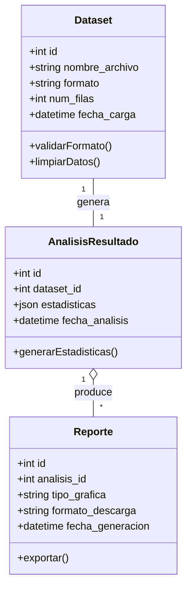
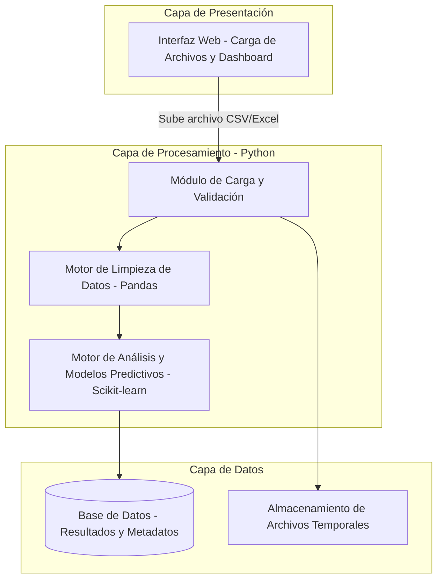

# Modelado Estructural y Diagramas de Arquitectura UML

## 1. Diagrama de Clases UML (Sintaxis Mermaid)

```mermaid
classDiagram
    class Dataset {
        +int id
        +string nombre_archivo
        +string formato
        +int num_filas
        +datetime fecha_carga
        +validarFormato()
        +limpiarDatos()
    }
    class AnalisisResultado {
        +int id
        +int dataset_id
        +json estadisticas
        +datetime fecha_analisis
        +generarEstadisticas()
    }
    class Reporte {
        +int id
        +int analisis_id
        +string tipo_grafica
        +string formato_descarga
        +datetime fecha_generacion
        +exportar()
    }
    Dataset "1" -- "1" AnalisisResultado : genera
    AnalisisResultado "1" o-- "*" Reporte : produce
```

## 2. Diagrama de Componentes y Despliegue (Mermaid)

```mermaid
graph TD
    subgraph Cliente [Capa de Presentación]
        Frontend[Interfaz Web - Carga de Archivos y Dashboard]
    end
    subgraph Servidor [Capa de Procesamiento - Python]
        API[Módulo de Carga y Validación]
        Limpieza[Motor de Limpieza de Datos - Pandas]
        Analitica[Motor de Análisis y Modelos Predictivos - Scikit-learn]
    end
    subgraph Persistencia [Capa de Datos]
        DB[(Base de Datos - Resultados y Metadatos)]
        FS[Almacenamiento de Archivos Temporales]
    end
    Frontend -->|Sube archivo CSV/Excel| API
    API --> Limpieza
    Limpieza --> Analitica
    Analitica --> DB
    API --> FS
```